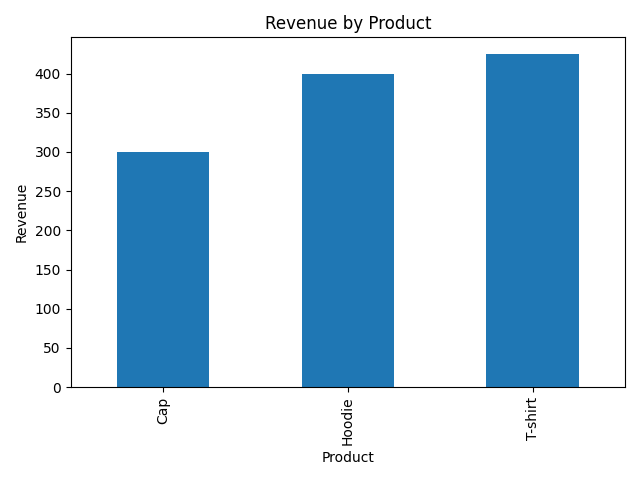

#  Basic Sales Summary using SQLite & Python

This project connects to a tiny SQLite database (`sales_data.db`) to extract sales information using SQL, summarize the data with pandas, and visualize the result using matplotlib.

##  Objective

- Practice SQL queries in Python using sqlite3
- Summarize total quantity sold and total revenue per product
- Display output in terminal and as a basic bar chart

---

##  Project Files

- `sales_data.db` – SQLite database with a sample `sales` table
- `task_7_sales_summary.py` – Python script that:
  - Connects to the database
  - Runs SQL queries for quantity & revenue
  - Prints a summary table
  - Creates a revenue bar chart (`sales_chart.png`)
- `sales_chart.png` – Bar chart of product revenue (auto-generated when script is run)

---

##  Key Concepts Covered

- SQL `GROUP BY`, `SUM()` for aggregation
- SQL inside Python using `sqlite3`
- Data import using `pandas.read_sql_query`
- Simple data visualization using `matplotlib`
- Why use SQL inside Python: reproducibility, scripting, automation

---

##  Sample Output
